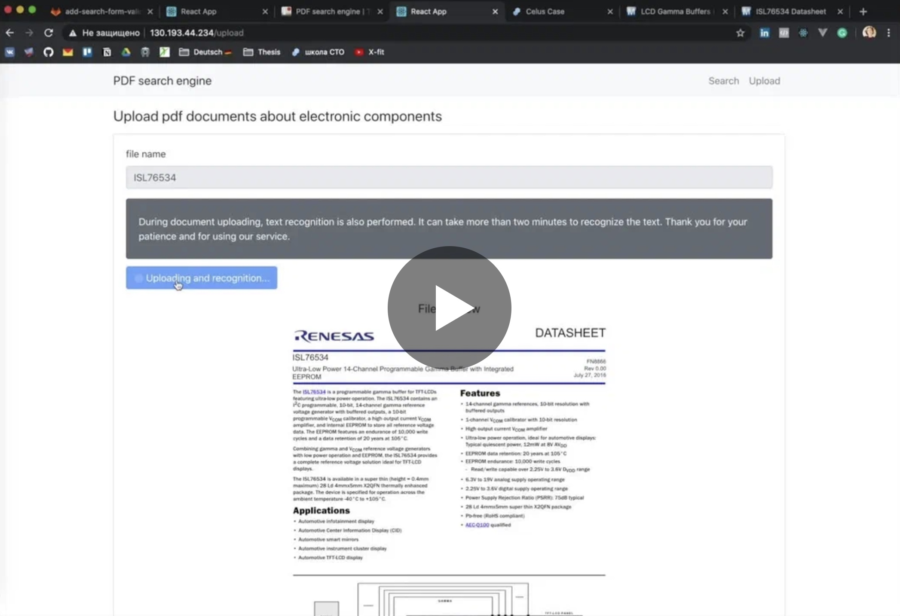

# PDF search engine

## Demo

[](https://disk.yandex.ru/i/XbzvvcUy0dUPjg)

## Presentation

[](https://docs.google.com/presentation/d/1y-OUtIW3nXvXbSn-BWsRmvaYVhP_hJA2_fD6fH5om2Q)

## Docker
The service is containerized into four containers, one for the [client side](#client-side), another one for the [server side](#server-side), and the last two for the [databases](#databases).

In order to run the service locally one should use commands below:

start:
```shell script
docker-compose up
```

django:
```shell script
$ docker exec -it web /bin/bash
$ cd pse
$ python manage.py populatedb                           # to insert test data to db
$ python manage.py get_document --name <document_name>  # to get document from db by name
```

stop:
```shell script
docker-compose down
```

## Client side
The client side is developed using [React](https://reactjs.org/ "React.js home page") and consists of two main components such as the [Upload component](#upload-component) and the [Search component](#search-component).

A user can navigate between two devoted interfaces, which enables them to use upload and search features independently.

### Upload component
A user is provided with a form to fill in the name of a document they want to upload. The component then sends the request to the server side and retrieves a status code that tells whether the document has been handled successfully or an error has occurred during a certain procedure.

Use `http://0.0.0.0:8000/upload/` for upload.

The request body is shown below:
```
{
    "file":<File content>,
    "filename":"NUP4114"
}
```

and headers are
```
Content-Type: multipart/form-data;
```

### Search component
The search interface includes two forms for a user to provide the component's name and an electrical characteristic to search for in documents that correspond to the component.

Use `http://0.0.0.0:8000/slow-search/` for search.

The request body is shown below:
```
{
    "name":"NUP4114",
    "keywords":"voltage"
}
```

## Server side
The server side is implemented using [Django](https://www.djangoproject.com/ "Django project home page"), a Python Web framework. Backend architecture could be divided into built-in Django REST Router, views to handle requests from frontend components, and object models connected to the databases.

### Upload view
Receives a document from the [Upload component](#upload-component), splits the document into pages, and sends the document along with each of its pages to [Yandex.Vision](#yandexvision) adapter.

The adapter returns parsed data for each passed document. The data about the document is then stored using the [Document model](#document-model) and the data about each of its pages and tables is stored using the [Page model](#page-model) and the [Table model](#table-model), respectively.

After that, the whole document and each of its pages are stored into [Yandex Object Storage](#yandex-object-storage), and a static URL for each file is generated.

Finally, the resulting status code is sent to the frontend _(could be described in more detail by listing all of the used codes)_.

### Search view

Receives a request from the [Search component](#search-component) that consists of a document name and certain keywords, gathers all the documents from the [Document model](#document-model) that correspond to received document name, then for each found document returns URLs of those pages that contain all of the mentioned keywords to the frontend side.

Along with keywords certain operands can be used to form a search query. Those operands include:

_(to be listed)_

The response model is shown below:
```
{
    "NUP4114": {
      "pages": {
        "2": "https://github.com/antosha417/test_temp/raw/master/NUP4114/NUP4114-2.pdf",
        "3": "https://github.com/antosha417/test_temp/raw/master/NUP4114/NUP4114-3.pdf"
      },
      "tables": {
        "2": "https://github.com/antosha417/test_temp/raw/master/NUP4114/NUP4114-2.csv"
      }
    }
}
```

### Document model
Document entity contains information about document's name, URL of a pdf-file in [Yandex Object Storage](#yandex-object-storage) corresponding to that document, and a list of pages it consists of.
```
name = models.CharField(max_length=200)
url = models.URLField()
pages = models.ArrayField(
   model_container=Page,
   model_form_class=PageForm
)
objects = models.DjongoManager()
```
### Page model
Page entity contains information about URL of a pdf-file in [Yandex Object Storage](#yandex-object-storage) corresponding to that page, its number in a document which it is a part of, raw contained text, and its json-structured data received from [Yandex.Vision](#yandex.vision) parser.
```
url = models.URLField()
num = models.IntegerField()
text = models.TextField()
vision = models.TextField()
```
### Table model
Table entity contains information about URL of a csv-file in [Yandex Object Storage](#yandex-object-storage) corresponding to that table, and its sequence number on a page it has been found on.
```
url = models.URLField()
num = models.IntegerField()
```
## Databases
### MongoDB
Inside this database all objects that are used by the service are stored using previously mentioned object models.

### Elastic search
This database is solely used to store data from parsed pages. This enables the service to search faster and more efficiently for the data that has been requested by the user.

## Other technologies used
### Yandex.Vision
With the help of [Yandex.Vision](https://cloud.yandex.ru/services/vision "Yandex Vision home page") adapter uploaded documents and their pages are parsed into text, tables _and images (not implemented yet)_. More that that, a complex json-structure corresponding to the data inside the passed document is returned.

All of this data is then stored into [databases](#databases).

### Yandex Object Storage
All of the uploaded documents and their pages are stored in [Yandex Object Storage](https://cloud.yandex.ru/services/storage "Yandex Object Storage home page") as raw files. Later on, they can be accessed through the service via generated static URLs.
